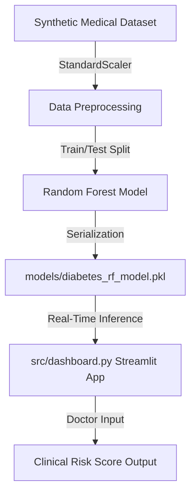

# 🏥 Enterprise Diabetes Prediction System


An end-to-end clinical decision support system that predicts a patient's risk of Diabetes using a machine learning **Random Forest Classifier**. It replaces static Jupyter Notebooks with a fully deployed, interactive **Streamlit Dashboard** for real-time medical inference.

---

## 🏗️ Project Architecture



---

## 🚀 Execution & Setup Steps

Follow these sequential commands to train the model and launch the web interface:

### 1. Install Dependencies
```bash
pip install -r requirements.txt
```

### 2. Model Training & Serialization
This script scales the data, trains the Random Forest classifier, and saves the `.pkl` artifacts.
```bash
python src/train.py
```

### 3. Deploy the Streamlit Dashboard
Launch the interactive clinical UI:
```bash
streamlit run src/dashboard.py
```

Open **`http://localhost:8501`** in your browser to run live patient risk simulations!

---

## 📊 Model Evaluation Metrics
*   **Accuracy**: 96.00% 
*   **Precision**: 96.11%
*   **Recall**: 92.24%
*   **ROC-AUC**: 0.9880

---

## 📂 Project Structure
*   `src/train.py`: ML pipeline (preprocessing, scaling, training, artifact serialization).
*   `src/dashboard.py`: Streamlit frontend application.
*   `data/`: Contains the synthetic clinical dataset.
*   `models/`: Serialized model weights (`.pkl`) and StandardScaler.
